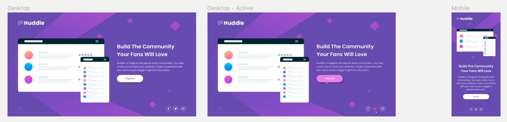

# Frontend Mentor Challenge - Huddle Landing Page Solution 🎭

Hello, 你好, 안녕하세요, Hola, Hallo, Bonjour!  

Welcome to my **mobile-first**, **responsive**, **accessible** solution the **[Huddle Landing Page Challenge](https://www.frontendmentor.io/challenges/huddle-landing-page-with-a-single-introductory-section-B_2Wvxgi0/hub)** from Frontend Mentor!

## Table of Contents 🧵
<hr>

- [Overview 🔎](https://github.com/JoleneKearse/fem-huddle-landing-page#overview-)
  - [The Challenge 🏁](https://github.com/JoleneKearse/fem-huddle-landing-page#the-challenge-)
  - [Screenshot 📸](https://github.com/JoleneKearse/fem-huddle-landing-page#screenshot-)
  - [Links 🔗](https://github.com/JoleneKearse/fem-huddle-landing-page#links-)

- [My Process 🤔](https://github.com/JoleneKearse/fem-huddle-landing-page#my-process-)
  - [Built with 🛠](https://github.com/JoleneKearse/fem-huddle-landing-page#built-with-)
  - [What I learned 📜](https://github.com/JoleneKearse/fem-huddle-landing-page#what-i-learned-)
  - [Continued development 🎓](https://github.com/JoleneKearse/fem-huddle-landing-page#continued-development-)
  - [Useful resources 📚](https://github.com/JoleneKearse/fem-huddle-landing-page#useful-resources-)
- [Author 🤪](https://github.com/JoleneKearse/fem-huddle-landing-page#author-)
 - [My journey 📆](https://github.com/JoleneKearse/fem-huddle-landing-page#my-journey-)
 - [Let's connect 🗯](https://github.com/JoleneKearse/fem-huddle-landing-page#lets-connect-)

## Overview 🔎
<hr>

### The Challenge 🏁

Users should be able to:
- [x] View the optimal layout for the page depending on their device's screen size
- [x] See hover states for all interactive elements on the page

### Screenshot 📸

Here's the provided design files:


And, tada 🪄, my solution - also in desktop, active states and mobile views:


### Links 🔗

- [Github](https://github.com/JoleneKearse/fem-huddle-landing-page#overview-) - I certainly hope you're checking out this awesome-sauce README that I spent a fun evening composing!
- [Live link]() - And also hope you, spectacular 🌟 you, have the time to impart your so-appreciated code reviews to me.  

## My Process 🤔

I generally always start out **mobile-first**, but I had recently caught an article on whether mobile-first should be your choice.  So, I considered the use case of this particular website...
- I could see a product manager going into a company boardroom and doing an awesome lead-through of the product...
- ... but then thought, hmm... most users would come from emails or calls to action from elsewhere, so...
- The majority would probably still see it from their mobiles! 

So mobile-first won out! 🎆

Next I decided, semi-with-crossed-fingers 🤞, that the 'cross the diamond' images in the back would be do-able with psuedo-elements and decided to leave that until the end.  _I'm hoping that doesn't come back to bite me in the butt!_ ⚡

### Built with 🛠
- Semantic HTML5 markup - _I'd forgotten this on my last challenge, which I blame React for. !_ 🤣
- CSS custom properties
- Mobile-first workflow

### What I learned 📜

1) I do not know as much about applying `:hover` and `:focus` effects to **svg** images as I thought!

Full disclosure: I originally exported the assets from **Figma** as **PNG** files.  _This dates back to my teaching career, where I needed the transparency of the PNG image file format - ingrained habits break hard_. But then I hated the _blurriness_ of the images and switched back to **SVG**.

I was 💯 sure that you could modify SVG file colours (_Yes, I'm Canadian, and use Canadian spellings_) with CSS.  But **I don't have as much experience exporting assets from Figma**, so may be completely missing something here.  

No matter what I did, I wasn't able to change the colour on a state change!

I applied a class of `.icon` to each, but 
```CSS
.icon:hover,
.icon:focus {
  color: var(--clr-accent-300);
}
```
didn't work!

Huh?

So, I will admit I went to [ChatGPT](https://chat.openai.com/chat) for help... and probably a bit too early.  I blindly followed it's solution of
```CSS
.icon path[stroke="white"]:hover {
  stroke: var(--clr-accent-300);
}
```
and the multitude of other complicated selectors I had to add on after hunting down the `white` in the `.svg` files.  Like, it was so much work and didn't even work!

Next I asked our friendly neighbourhood AI if I could do it with JavaScript.  Again I blindly followed along...  After some clarifying questions, I identified it wouldn't have worked anyway.

So...

I went back to a good old-fashioned Google search and was reminded of the `filter` property.  I read a few articles, then, duh 🤦, remembered that there are so, so, so many intelligent software engineers already out there!

Well, one of them must have created a [handly-dandy generator](https://codepen.io/sosuke/pen/Pjoqqp).  Lo and behold, someone had!  

---

### Continued development 🎓

### Useful resources 📚

[Is Mobile First Always The Best Approach?](https://cleancommit.io/blog/is-mobile-first-always-the-best-approach/)

[ChatGPT](https://chat.openai.com/chat)

[CSS filter generator to convert from black to target hex color](https://codepen.io/sosuke/pen/Pjoqqp)

[Font-size Clamp Generator](https://clamp.font-size.app/)

[Responsively](https://responsively.app/download)

[Viewport Resizer Chrome Extension](https://chrome.google.com/webstore/detail/viewport-resizer-%E2%80%93-respon/kapnjjcfcncngkadhpmijlkblpibdcgm/related?hl=en)


## Author 🤪
<hr>

Hiya! 👋 My name is **Jolene Kearse**, (no pronouns, as Jolene, or pretty much whatever you want to call me - within limits 🤣 - is fine with me).  

I may be a _tad_ older than you at 41 👊, simply because I was an **English as a Foreign Language Teacher** ️🌏🧑‍🏫 for over 15 years - so, yeah, _for a little bit_ 🤌...  I lived all over the world, including China, England & South Korea.

But that was then! 

...

Now I'm an awesome **Software Engineer**! :dancer:  I'm a **proud, self-taught individual**. 

### My journey 📆

I'm also proud of how far I came in 2022.  I finally learned **JavaScript**! 🍻 _I had struggled for about a year before I finally could add that to my skillset.  If you're interested in an awesome 🔥 course check out **[Class Central's Bootcamp YouTube Playlist going through freeCodeCamp's Algorithms and Data Structures Certification](https://www.youtube.com/playlist?list=PLU3RKvMpgrSEoqVIV14K_zuinrIBcnCgT)._

Then I met an awesome group of fellow-learning devs, **The Explorers**.  This exposed me to the myriad and oft-confusing ways of using **Git** in a team - loving it now!  But also projects using so many kinds of tech that would've just blown my mind a year before 🤯 including:
- React
- TypeScript
- Tailwind

I even participated in **[#Hacktoberfest](https://hacktoberfest.com/)** and earned the coveted T-shirt! 🎉👕

But who cares about 2022? This is 2023!

...

I've been boning up on **React**, and just taking so many courses to learn **Backend Development** and **navigate the process of earning my first tech job**!

One of those courses has seen me going back to **Python** - which I had treated as my _crutch language_ to understand JavaScript.  🤣  But I've been loving navigating in multiple languages.

Another challenge I am undertaking this year is [Exercism's](https://exercism.org/) **#12in23**.  This is a cool 😎 opportunity to _try out_ 12 different languages this year.  Each month has a theme, like **Functional February** and **Mechanical March** to encourage you to check out different language paradims.  I'm loving this chance to dip my toe in other types of programming.  I find I'm gaining the ability to evaluate various language's strengths and project needs.

### Let's connect 🗯

I'd love ❤️ to connect with y'all (_sorry, I love using that ironicallly and do so with great frequency_ 😜):
- [LinkedIn](https://www.linkedin.com/in/jolene-kearse-2562ba218/)
- [Github](https://github.com/JoleneKearse)
- [Twitter](https://twitter.com/FromJolene)


